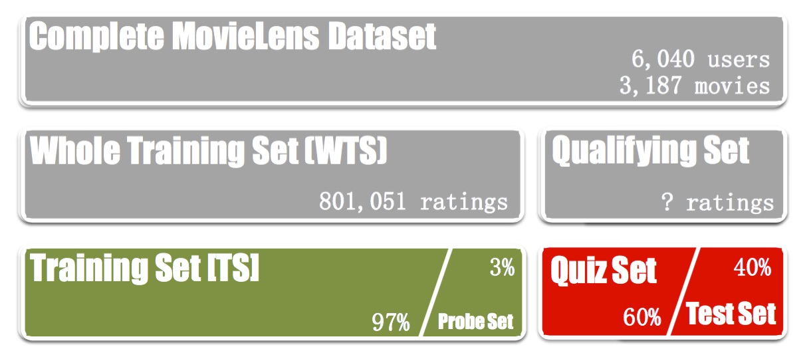
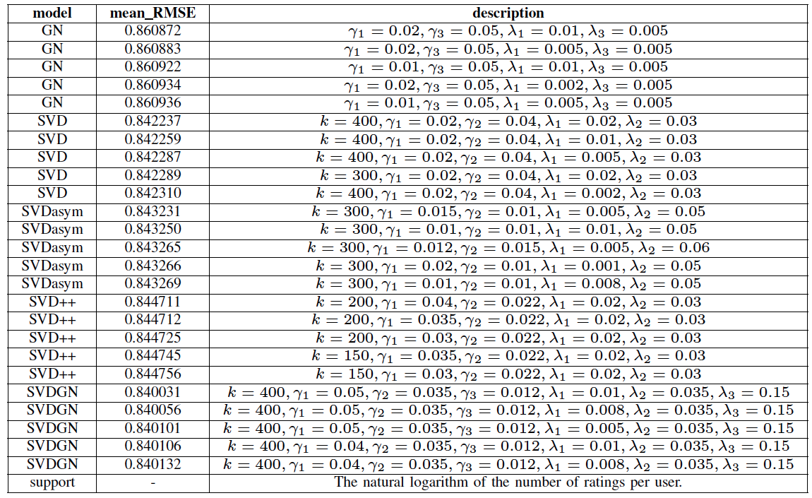

# Rice STAT640: Data Mining and Statistical Learning, Movie Recommender System 

Copyright: Team 1UP+, https://inclass.kaggle.com/c/movie-recommendations/leaderboard

## Introduction
This folder includes everything to reproduce what we did to train models and predict with self-implemented software MovieLens. The program MovieLens is coded using C++.

The program MovieLens only requires GNU C/C++ compiler, so it can be complied in almost every Linux computer. 


## Data
The MovieLens academic dataset provides ratings of the 6,040 users to 3,187 movies. The Whole Training Set (WTS) available to students includes 801,051 (4.15%) ratings, user meta-data (gender, age, and occupation), and movie meta-data (name and genres). Ratings are integers between 1 to 5. 

The Qualifying Set on Kaggle is split into two parts: Quiz set, which is used for evaluate the submission in public leaderboard, and Test Set, which will be used for calculating final score. 

For the purpose of training and comparing models, the hand-out WTS is split randomly into 

 + Training Set (TS, 97% of WTS) 
 + Probe Set (3% of WTS). 



Probe set is used for:
 
 + model training: gradient descent optimization
 + parameter tuning: compare Probe RMSE
 + model combination: train blending model

## Model Training and Prediction
### compile the program
`make all` 

 This will generate a executable file MovieLens.

### manual
`./MovieLens --help`

### output
 A .json file for log information and a .csv file for predication.

There are two modes (the third parameter) for model training and prediction: 

+  "probe" means training the model on part of training set (97% of whole training set) and predict on the rest of training set, we call it as probe set (3%, this will be used to train blending model);
+  "wts" means training with whole training set and predict all missing entries (don't include original training set).

### commands for the final submission
 For the final submission, we trained 25 models: 

 + 5 of Global Neighborhood (GN) model
 + 5 of Singular Value Decomposition (SVD) model
 + 5 of Asymmetric-SVD (SVDasym) model 
 + 5 of SVD++ (SVDpp) model
 + 5 of integrated (SVDGN) model  


 Each model is associated with two commands: 

 + training on 97% of training set and predict the probe set, the mode is "probe";
 + training on whole training set and predict all missing entries, the mode is "wts". 

The exact commands used for these 25 models are

```sh
## GN model
./MovieLens probe_neighbor_probe_g1E0p02_g3E0p05_l6E0p01_l8E0p005-25181434 neighbor probe  --gamma3 0.05 --baseiter 15 --gamma1 0.02 --gamma0 0.001 --lambda8 0.005 --slowrate 0.9 --alpha 0.5 --lambda6 0.01 --lambda0 0.01 --maxiter 30
./MovieLens wts_neighbor_probe_g1E0p02_g3E0p05_l6E0p01_l8E0p005-25181434 neighbor wts  --gamma3 0.05 --baseiter 15 --gamma1 0.02 --gamma0 0.001 --lambda8 0.005 --slowrate 0.9 --alpha 0.5 --lambda6 0.01 --lambda0 0.01 --maxiter 30 -l
./MovieLens probe_neighbor_probe_g1E0p02_g3E0p05_l6E0p005_l8E0p005-25181434 neighbor probe  --gamma3 0.05 --baseiter 15 --gamma1 0.02 --gamma0 0.001 --lambda8 0.005 --slowrate 0.9 --alpha 0.5 --lambda6 0.005 --lambda0 0.01 --maxiter 30
./MovieLens wts_neighbor_probe_g1E0p02_g3E0p05_l6E0p005_l8E0p005-25181434 neighbor wts  --gamma3 0.05 --baseiter 15 --gamma1 0.02 --gamma0 0.001 --lambda8 0.005 --slowrate 0.9 --alpha 0.5 --lambda6 0.005 --lambda0 0.01 --maxiter 30 -l
./MovieLens probe_neighbor_probe_g1E0p01_g3E0p05_l6E0p01_l8E0p005-25181434 neighbor probe  --gamma3 0.05 --baseiter 15 --gamma1 0.01 --gamma0 0.001 --lambda8 0.005 --slowrate 0.9 --alpha 0.5 --lambda6 0.01 --lambda0 0.01 --maxiter 26
./MovieLens wts_neighbor_probe_g1E0p01_g3E0p05_l6E0p01_l8E0p005-25181434 neighbor wts  --gamma3 0.05 --baseiter 15 --gamma1 0.01 --gamma0 0.001 --lambda8 0.005 --slowrate 0.9 --alpha 0.5 --lambda6 0.01 --lambda0 0.01 --maxiter 26 -l
./MovieLens probe_neighbor_probe_g1E0p02_g3E0p05_l6E0p002_l8E0p005-25181434 neighbor probe  --gamma3 0.05 --baseiter 15 --gamma1 0.02 --gamma0 0.001 --lambda8 0.005 --slowrate 0.9 --alpha 0.5 --lambda6 0.002 --lambda0 0.01 --maxiter 30
./MovieLens wts_neighbor_probe_g1E0p02_g3E0p05_l6E0p002_l8E0p005-25181434 neighbor wts  --gamma3 0.05 --baseiter 15 --gamma1 0.02 --gamma0 0.001 --lambda8 0.005 --slowrate 0.9 --alpha 0.5 --lambda6 0.002 --lambda0 0.01 --maxiter 30 -l
./MovieLens probe_neighbor_probe_g1E0p01_g3E0p05_l6E0p005_l8E0p005-25181434 neighbor probe  --gamma3 0.05 --baseiter 15 --gamma1 0.01 --gamma0 0.001 --lambda8 0.005 --slowrate 0.9 --alpha 0.5 --lambda6 0.005 --lambda0 0.01 --maxiter 27
./MovieLens wts_neighbor_probe_g1E0p01_g3E0p05_l6E0p005_l8E0p005-25181434 neighbor wts  --gamma3 0.05 --baseiter 15 --gamma1 0.01 --gamma0 0.001 --lambda8 0.005 --slowrate 0.9 --alpha 0.5 --lambda6 0.005 --lambda0 0.01 --maxiter 27 -l

## SVD model
./MovieLens probe_svd_probe_factor400_g1E0p02_g2E0p04_l6E0p02_l7E0p03-28151302 svd probe  --gamma2 0.04 --gamma1 0.02 --gamma0 0.001 --slowrate 0.9 --factor 400 --alpha 0.5 --lambda6 0.02 --lambda7 0.03 --lambda0 0.01 --baseiter 15 --maxiter 250
./MovieLens wts_svd_probe_factor400_g1E0p02_g2E0p04_l6E0p02_l7E0p03-28151302 svd wts  --gamma2 0.04 --gamma1 0.02 --gamma0 0.001 --slowrate 0.9 --factor 400 --alpha 0.5 --lambda6 0.02 --lambda7 0.03 --lambda0 0.01 --baseiter 15 --maxiter 250 -l
./MovieLens probe_svd_probe_factor400_g1E0p02_g2E0p04_l6E0p01_l7E0p03-28151302 svd probe  --gamma2 0.04 --gamma1 0.02 --gamma0 0.001 --slowrate 0.9 --factor 400 --alpha 0.5 --lambda6 0.01 --lambda7 0.03 --lambda0 0.01 --baseiter 15 --maxiter 250
./MovieLens wts_svd_probe_factor400_g1E0p02_g2E0p04_l6E0p01_l7E0p03-28151302 svd wts  --gamma2 0.04 --gamma1 0.02 --gamma0 0.001 --slowrate 0.9 --factor 400 --alpha 0.5 --lambda6 0.01 --lambda7 0.03 --lambda0 0.01 --baseiter 15 --maxiter 250 -l
./MovieLens probe_svd_probe_factor400_g1E0p02_g2E0p04_l6E0p005_l7E0p03-28151302 svd probe  --gamma2 0.04 --gamma1 0.02 --gamma0 0.001 --slowrate 0.9 --factor 400 --alpha 0.5 --lambda6 0.005 --lambda7 0.03 --lambda0 0.01 --baseiter 15 --maxiter 250
./MovieLens wts_svd_probe_factor400_g1E0p02_g2E0p04_l6E0p005_l7E0p03-28151302 svd wts  --gamma2 0.04 --gamma1 0.02 --gamma0 0.001 --slowrate 0.9 --factor 400 --alpha 0.5 --lambda6 0.005 --lambda7 0.03 --lambda0 0.01 --baseiter 15 --maxiter 250 -l
./MovieLens probe_svd_probe_factor300_g1E0p02_g2E0p04_l6E0p02_l7E0p03-28151302 svd probe  --gamma2 0.04 --gamma1 0.02 --gamma0 0.001 --slowrate 0.9 --factor 300 --alpha 0.5 --lambda6 0.02 --lambda7 0.03 --lambda0 0.01 --baseiter 15 --maxiter 250
./MovieLens wts_svd_probe_factor300_g1E0p02_g2E0p04_l6E0p02_l7E0p03-28151302 svd wts  --gamma2 0.04 --gamma1 0.02 --gamma0 0.001 --slowrate 0.9 --factor 300 --alpha 0.5 --lambda6 0.02 --lambda7 0.03 --lambda0 0.01 --baseiter 15 --maxiter 250 -l
./MovieLens probe_svd_probe_factor400_g1E0p02_g2E0p04_l6E0p002_l7E0p03-28151302 svd probe  --gamma2 0.04 --gamma1 0.02 --gamma0 0.001 --slowrate 0.9 --factor 400 --alpha 0.5 --lambda6 0.002 --lambda7 0.03 --lambda0 0.01 --baseiter 15 --maxiter 250
./MovieLens wts_svd_probe_factor400_g1E0p02_g2E0p04_l6E0p002_l7E0p03-28151302 svd wts  --gamma2 0.04 --gamma1 0.02 --gamma0 0.001 --slowrate 0.9 --factor 400 --alpha 0.5 --lambda6 0.002 --lambda7 0.03 --lambda0 0.01 --baseiter 15 --maxiter 250 -l

## SVDasym model
./MovieLens probe_svdasym_probe_factor300_g1E0p015_g2E0p01_l6E0p005_l7E0p05-24121625 svdasym probe  --gamma2 0.01 --gamma1 0.015 --gamma0 0.001 --slowrate 0.9 --factor 300 --alpha 0.5 --lambda6 0.005 --lambda7 0.05 --lambda0 0.01 --maxiter 43
./MovieLens wts_svdasym_probe_factor300_g1E0p015_g2E0p01_l6E0p005_l7E0p05-24121625 svdasym wts  --gamma2 0.01 --gamma1 0.015 --gamma0 0.001 --slowrate 0.9 --factor 300 --alpha 0.5 --lambda6 0.005 --lambda7 0.05 --lambda0 0.01 --maxiter 43 -l
./MovieLens probe_svdasym_probe_factor300_g1E0p01_g2E0p01_l6E0p01_l7E0p05-24121625 svdasym probe  --gamma2 0.01 --gamma1 0.01 --gamma0 0.001 --slowrate 0.9 --factor 300 --alpha 0.5 --lambda6 0.01 --lambda7 0.05 --lambda0 0.01 --maxiter 43
./MovieLens wts_svdasym_probe_factor300_g1E0p01_g2E0p01_l6E0p01_l7E0p05-24121625 svdasym wts  --gamma2 0.01 --gamma1 0.01 --gamma0 0.001 --slowrate 0.9 --factor 300 --alpha 0.5 --lambda6 0.01 --lambda7 0.05 --lambda0 0.01 --maxiter 43 -l
./MovieLens probe_svdasym_probe_factor300_g1E0p012_g2E0p015_l6E0p005_l7E0p06-28151846 svdasym probe  --gamma2 0.015 --gamma1 0.012 --gamma0 0.001 --slowrate 0.9 --factor 300 --alpha 0.5 --lambda6 0.005 --lambda7 0.06 --lambda0 0.01 --maxiter 21
./MovieLens wts_svdasym_probe_factor300_g1E0p012_g2E0p015_l6E0p005_l7E0p06-28151846 svdasym wts  --gamma2 0.015 --gamma1 0.012 --gamma0 0.001 --slowrate 0.9 --factor 300 --alpha 0.5 --lambda6 0.005 --lambda7 0.06 --lambda0 0.01 --maxiter 21 -l
./MovieLens probe_svdasym_probe_factor300_g1E0p02_g2E0p01_l6E0p001_l7E0p05-24121625 svdasym probe  --gamma2 0.01 --gamma1 0.02 --gamma0 0.001 --slowrate 0.9 --factor 300 --alpha 0.5 --lambda6 0.001 --lambda7 0.05 --lambda0 0.01 --maxiter 43
./MovieLens wts_svdasym_probe_factor300_g1E0p02_g2E0p01_l6E0p001_l7E0p05-24121625 svdasym wts  --gamma2 0.01 --gamma1 0.02 --gamma0 0.001 --slowrate 0.9 --factor 300 --alpha 0.5 --lambda6 0.001 --lambda7 0.05 --lambda0 0.01 --maxiter 43 -l
./MovieLens probe_svdasym_probe_factor300_g1E0p01_g2E0p01_l6E0p008_l7E0p05-24121625 svdasym probe  --gamma2 0.01 --gamma1 0.01 --gamma0 0.001 --slowrate 0.9 --factor 300 --alpha 0.5 --lambda6 0.008 --lambda7 0.05 --lambda0 0.01 --maxiter 43
./MovieLens wts_svdasym_probe_factor300_g1E0p01_g2E0p01_l6E0p008_l7E0p05-24121625 svdasym wts  --gamma2 0.01 --gamma1 0.01 --gamma0 0.001 --slowrate 0.9 --factor 300 --alpha 0.5 --lambda6 0.008 --lambda7 0.05 --lambda0 0.01 --maxiter 43 -l

## SVD++ model
./MovieLens probe_svdpp_probe_factor200_g1E0p04_g2E0p022_l6E0p02_l7E0p03-28152631 svdpp probe  --gamma2 0.022 --gamma1 0.04 --gamma0 0.001 --slowrate 0.9 --factor 200 --alpha 0.5 --lambda6 0.02 --lambda7 0.03 --lambda0 0.01 --baseiter 15 --maxiter 250
./MovieLens wts_svdpp_probe_factor200_g1E0p04_g2E0p022_l6E0p02_l7E0p03-28152631 svdpp wts  --gamma2 0.022 --gamma1 0.04 --gamma0 0.001 --slowrate 0.9 --factor 200 --alpha 0.5 --lambda6 0.02 --lambda7 0.03 --lambda0 0.01 --baseiter 15 --maxiter 250 -l
./MovieLens probe_svdpp_probe_factor200_g1E0p035_g2E0p022_l6E0p02_l7E0p03-28152631 svdpp probe  --gamma2 0.022 --gamma1 0.035 --gamma0 0.001 --slowrate 0.9 --factor 200 --alpha 0.5 --lambda6 0.02 --lambda7 0.03 --lambda0 0.01 --baseiter 15 --maxiter 250
./MovieLens wts_svdpp_probe_factor200_g1E0p035_g2E0p022_l6E0p02_l7E0p03-28152631 svdpp wts  --gamma2 0.022 --gamma1 0.035 --gamma0 0.001 --slowrate 0.9 --factor 200 --alpha 0.5 --lambda6 0.02 --lambda7 0.03 --lambda0 0.01 --baseiter 15 --maxiter 250 -l
./MovieLens probe_svdpp_probe_factor200_g1E0p03_g2E0p022_l6E0p02_l7E0p03-28152631 svdpp probe  --gamma2 0.022 --gamma1 0.03 --gamma0 0.001 --slowrate 0.9 --factor 200 --alpha 0.5 --lambda6 0.02 --lambda7 0.03 --lambda0 0.01 --baseiter 15 --maxiter 250
./MovieLens wts_svdpp_probe_factor200_g1E0p03_g2E0p022_l6E0p02_l7E0p03-28152631 svdpp wts  --gamma2 0.022 --gamma1 0.03 --gamma0 0.001 --slowrate 0.9 --factor 200 --alpha 0.5 --lambda6 0.02 --lambda7 0.03 --lambda0 0.01 --baseiter 15 --maxiter 250 -l
./MovieLens probe_svdpp_probe_factor150_g1E0p035_g2E0p022_l6E0p02_l7E0p03-28152631 svdpp probe  --gamma2 0.022 --gamma1 0.035 --gamma0 0.001 --slowrate 0.9 --factor 150 --alpha 0.5 --lambda6 0.02 --lambda7 0.03 --lambda0 0.01 --baseiter 15 --maxiter 250
./MovieLens wts_svdpp_probe_factor150_g1E0p035_g2E0p022_l6E0p02_l7E0p03-28152631 svdpp wts  --gamma2 0.022 --gamma1 0.035 --gamma0 0.001 --slowrate 0.9 --factor 150 --alpha 0.5 --lambda6 0.02 --lambda7 0.03 --lambda0 0.01 --baseiter 15 --maxiter 250 -l
./MovieLens probe_svdpp_probe_factor150_g1E0p03_g2E0p022_l6E0p02_l7E0p03-28152631 svdpp probe  --gamma2 0.022 --gamma1 0.03 --gamma0 0.001 --slowrate 0.9 --factor 150 --alpha 0.5 --lambda6 0.02 --lambda7 0.03 --lambda0 0.01 --baseiter 15 --maxiter 250
./MovieLens wts_svdpp_probe_factor150_g1E0p03_g2E0p022_l6E0p02_l7E0p03-28152631 svdpp wts  --gamma2 0.022 --gamma1 0.03 --gamma0 0.001 --slowrate 0.9 --factor 150 --alpha 0.5 --lambda6 0.02 --lambda7 0.03 --lambda0 0.01 --baseiter 15 --maxiter 250 -l

## SVDGN
./MovieLens probe_svdneighbor_probe_factor400_g1E0p04_g2E0p035_g3E0p012_l6E0p008_l7E0p035_l8E0p15-30224814 svdneighbor probe  --gamma3 0.012 --gamma2 0.035 --gamma1 0.04 --gamma0 0.001 --lambda8 0.15 --slowrate 0.9 --factor 400 --alpha 0.5 --lambda6 0.008 --lambda7 0.035 --lambda0 0.01 --baseiter 15 --maxiter 250
./MovieLens wts_svdneighbor_probe_factor400_g1E0p04_g2E0p035_g3E0p012_l6E0p008_l7E0p035_l8E0p15-30224814 svdneighbor wts  --gamma3 0.012 --gamma2 0.035 --gamma1 0.04 --gamma0 0.001 --lambda8 0.15 --slowrate 0.9 --factor 400 --alpha 0.5 --lambda6 0.008 --lambda7 0.035 --lambda0 0.01 --baseiter 15 --maxiter 250 -l
./MovieLens probe_svdneighbor_probe_factor400_g1E0p04_g2E0p035_g3E0p012_l6E0p01_l7E0p035_l8E0p15-30224814 svdneighbor probe  --gamma3 0.012 --gamma2 0.035 --gamma1 0.04 --gamma0 0.001 --lambda8 0.15 --slowrate 0.9 --factor 400 --alpha 0.5 --lambda6 0.01 --lambda7 0.035 --lambda0 0.01 --baseiter 15 --maxiter 250
./MovieLens wts_svdneighbor_probe_factor400_g1E0p04_g2E0p035_g3E0p012_l6E0p01_l7E0p035_l8E0p15-30224814 svdneighbor wts  --gamma3 0.012 --gamma2 0.035 --gamma1 0.04 --gamma0 0.001 --lambda8 0.15 --slowrate 0.9 --factor 400 --alpha 0.5 --lambda6 0.01 --lambda7 0.035 --lambda0 0.01 --baseiter 15 --maxiter 250 -l
./MovieLens probe_svdneighbor_probe_factor400_g1E0p05_g2E0p035_g3E0p012_l6E0p005_l7E0p035_l8E0p15-30224814 svdneighbor probe  --gamma3 0.012 --gamma2 0.035 --gamma1 0.05 --gamma0 0.001 --lambda8 0.15 --slowrate 0.9 --factor 400 --alpha 0.5 --lambda6 0.005 --lambda7 0.035 --lambda0 0.01 --baseiter 15 --maxiter 250
./MovieLens wts_svdneighbor_probe_factor400_g1E0p05_g2E0p035_g3E0p012_l6E0p005_l7E0p035_l8E0p15-30224814 svdneighbor wts  --gamma3 0.012 --gamma2 0.035 --gamma1 0.05 --gamma0 0.001 --lambda8 0.15 --slowrate 0.9 --factor 400 --alpha 0.5 --lambda6 0.005 --lambda7 0.035 --lambda0 0.01 --baseiter 15 --maxiter 250 -l
./MovieLens probe_svdneighbor_probe_factor400_g1E0p05_g2E0p035_g3E0p012_l6E0p008_l7E0p035_l8E0p15-30224814 svdneighbor probe  --gamma3 0.012 --gamma2 0.035 --gamma1 0.05 --gamma0 0.001 --lambda8 0.15 --slowrate 0.9 --factor 400 --alpha 0.5 --lambda6 0.008 --lambda7 0.035 --lambda0 0.01 --baseiter 15 --maxiter 250
./MovieLens wts_svdneighbor_probe_factor400_g1E0p05_g2E0p035_g3E0p012_l6E0p008_l7E0p035_l8E0p15-30224814 svdneighbor wts  --gamma3 0.012 --gamma2 0.035 --gamma1 0.05 --gamma0 0.001 --lambda8 0.15 --slowrate 0.9 --factor 400 --alpha 0.5 --lambda6 0.008 --lambda7 0.035 --lambda0 0.01 --baseiter 15 --maxiter 250 -l
./MovieLens probe_svdneighbor_probe_factor400_g1E0p05_g2E0p035_g3E0p012_l6E0p01_l7E0p035_l8E0p15-30224814 svdneighbor probe  --gamma3 0.012 --gamma2 0.035 --gamma1 0.05 --gamma0 0.001 --lambda8 0.15 --slowrate 0.9 --factor 400 --alpha 0.5 --lambda6 0.01 --lambda7 0.035 --lambda0 0.01 --baseiter 15 --maxiter 250
./MovieLens wts_svdneighbor_probe_factor400_g1E0p05_g2E0p035_g3E0p012_l6E0p01_l7E0p035_l8E0p15-30224814 svdneighbor wts  --gamma3 0.012 --gamma2 0.035 --gamma1 0.05 --gamma0 0.001 --lambda8 0.15 --slowrate 0.9 --factor 400 --alpha 0.5 --lambda6 0.01 --lambda7 0.035 --lambda0 0.01 --baseiter 15 --maxiter 250 -l
```

It may take several hours to run all 50 commands listed above. After it's done, there should be 50 .csv files in PredictRating/ folder: 25 of them are probe_model_***.csv and 25 of them are wts_model_***.csv. 


## Result


